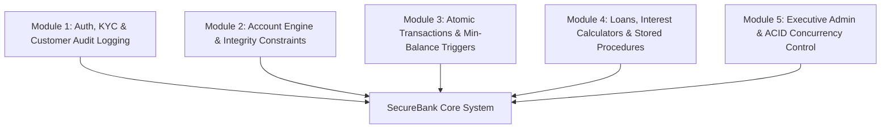

# 🎓 Advanced SQL Project Review — 5 Core Categorized Modules

This document outlines the **5 Categorized Advanced SQL & System Modules** mapped directly from the **SecureBank PPT presentation deck** for your project review presentation.

---

## 🏛️ Executive Summary & Module Overview



---

## 1️⃣ Module 1: Authentication, Customer KYC & Audit Logging

### Overview & Capabilities
- **Role-Based Access Control (RBAC)**: Separates Customer users from System Administrators via JWT tokens.
- **KYC Verification**: Unique constraints on PAN (`VARCHAR(10)`) and Aadhar (`VARCHAR(12)`).
- **Customer Status Audit Trigger (`trg_log_customer_status_change`)**: Automatically records customer status updates (Active, Inactive, Blocked) to the `Customer_Status_Audit` table whenever an admin modifies customer state.

### Key Advanced SQL Implementation
```sql
CREATE TABLE IF NOT EXISTS Customer_Status_Audit (
    audit_id INT PRIMARY KEY AUTO_INCREMENT,
    customer_id INT,
    customer_name VARCHAR(100),
    old_status VARCHAR(20),
    new_status VARCHAR(20),
    changed_at TIMESTAMP DEFAULT CURRENT_TIMESTAMP
);

DELIMITER //
CREATE TRIGGER trg_log_customer_status_change
AFTER UPDATE ON Customer
FOR EACH ROW
BEGIN
    IF OLD.status != NEW.status THEN
        INSERT INTO Customer_Status_Audit (customer_id, customer_name, old_status, new_status)
        VALUES (NEW.customer_id, CONCAT(NEW.first_name, ' ', NEW.last_name), OLD.status, NEW.status);
    END IF;
END//
DELIMITER ;
```

---

## 2️⃣ Module 2: Bank Account Engine & Data Integrity Constraints

### Overview & Capabilities
- **Multi-Account Types**: Supports Savings (4.00% p.a.), Current (Business), and Fixed Deposits (6.50% p.a.).
- **Balance Constraint Safeguard (`chk_balance`)**: Enforces domain integrity ensuring account balances can never be negative.
- **Instant Card Generation**: Links debit/credit cards with 16-digit card numbers, CVV, and daily limits to active accounts.

### Key Advanced SQL Implementation
```sql
ALTER TABLE Account
ADD CONSTRAINT chk_balance CHECK (balance >= 0);

ALTER TABLE Account
MODIFY branch_code VARCHAR(10) NOT NULL DEFAULT 'CHN001';
```

---

## 3️⃣ Module 3: Advanced Transaction Processing & Minimum Balance Enforcement

### Overview & Capabilities
- **Atomic Money Operations**: Cash Deposits, ATM Withdrawals, and Inter-Account Transfers (IMPS, NEFT, RTGS).
- **Automatic Balance Update Trigger (`trg_update_balance_after_txn`)**: Automatically recalculates account balance upon every insert to `Transaction`.
- **Minimum Balance Guard Trigger (`trg_check_minimum_balance`)**: Blocks any withdrawal attempt if remaining balance falls below minimum balance (default ₹1,000) by throwing an explicit SQL Exception (`SQLSTATE 45000`).

### Key Advanced SQL Implementation
```sql
DELIMITER //
CREATE TRIGGER trg_check_minimum_balance
BEFORE INSERT ON Transaction
FOR EACH ROW
BEGIN
    DECLARE v_current_balance DECIMAL(15,2);
    DECLARE v_min_balance DECIMAL(10,2);
    
    IF NEW.transaction_type = 'Withdrawal' THEN
        SELECT balance, minimum_balance INTO v_current_balance, v_min_balance
        FROM Account WHERE account_id = NEW.account_id;
        
        IF (v_current_balance - NEW.amount) < v_min_balance THEN
            SIGNAL SQLSTATE '45000'
            SET MESSAGE_TEXT = 'Withdrawal denied: Balance would fall below minimum balance';
        END IF;
    END IF;
END//
DELIMITER ;
```

---

## 4️⃣ Module 4: Loans Engine, Interest Calculators & Stored Procedures

### Overview & Capabilities
- **Loan Portfolio**: Home, Personal, Vehicle, Education, and Business loans with monthly EMI schedules.
- **Interest Calculator Stored Procedure (`sp_calculate_interest_all_accounts`)**: Uses SQL Cursors (`savings_cursor`) to iterate active savings accounts and compute monthly and annual payouts.
- **High-Risk Outstanding Loan Flagger (`sp_flag_high_outstanding_loans`)**: Evaluates debt ratios and assigns risk flags (`CRITICAL` >95%, `HIGH RISK` >90%, `NORMAL`).
- **Loan Payment Tracker View (`vw_loan_payment_tracker`)**: Pre-compiled view summarizing total paid vs outstanding principal and interest.

### Key Advanced SQL Implementation
```sql
DELIMITER //
CREATE PROCEDURE sp_flag_high_outstanding_loans()
BEGIN
    DECLARE done INT DEFAULT FALSE;
    DECLARE v_loan_id INT;
    DECLARE v_customer_name VARCHAR(100);
    DECLARE v_loan_type VARCHAR(20);
    DECLARE v_loan_amount DECIMAL(15,2);
    DECLARE v_outstanding DECIMAL(15,2);
    DECLARE v_percent_outstanding DECIMAL(5,2);
    DECLARE v_flag VARCHAR(20);
    
    DECLARE loan_cursor CURSOR FOR
        SELECT l.loan_id, CONCAT(c.first_name, ' ', c.last_name), l.loan_type, l.loan_amount, l.outstanding_amount
        FROM Loan l INNER JOIN Customer c ON l.customer_id = c.customer_id WHERE l.status = 'Disbursed';
    
    DECLARE CONTINUE HANDLER FOR NOT FOUND SET done = TRUE;
    
    CREATE TEMPORARY TABLE IF NOT EXISTS temp_loan_flags (
        loan_id INT, customer_name VARCHAR(100), loan_type VARCHAR(20), loan_amount DECIMAL(15,2),
        outstanding_amount DECIMAL(15,2), percent_outstanding DECIMAL(5,2), risk_flag VARCHAR(20)
    );
    
    DELETE FROM temp_loan_flags;
    OPEN loan_cursor;
    flag_loop: LOOP
        FETCH loan_cursor INTO v_loan_id, v_customer_name, v_loan_type, v_loan_amount, v_outstanding;
        IF done THEN LEAVE flag_loop; END IF;
        
        SET v_percent_outstanding = ROUND((v_outstanding / v_loan_amount) * 100, 2);
        IF v_percent_outstanding > 95 THEN SET v_flag = 'CRITICAL';
        ELSEIF v_percent_outstanding > 90 THEN SET v_flag = 'HIGH RISK';
        ELSE SET v_flag = 'NORMAL'; END IF;
        
        INSERT INTO temp_loan_flags VALUES (v_loan_id, v_customer_name, v_loan_type, v_loan_amount, v_outstanding, v_percent_outstanding, v_flag);
    END LOOP;
    CLOSE loan_cursor;
    SELECT * FROM temp_loan_flags ORDER BY percent_outstanding DESC;
    DROP TEMPORARY TABLE temp_loan_flags;
END//
DELIMITER ;
```

---

## 5️⃣ Module 5: Executive Admin Intelligence & ACID Concurrency Isolation

### Overview & Capabilities
- **Platform Executive Console**: Real-time aggregate statistics (Total Customers, Total Deposits, Active Loans, Global Transactions).
- **Customer Net-Worth View (`vw_customer_financial_profile`)**: Calculates total assets minus outstanding liabilities per customer.
- **ACID Concurrency Locking Modes**: Demonstrates row-level exclusive locks (`FOR UPDATE`), shared read locks (`LOCK IN SHARE MODE`), table locks, savepoints (`SAVEPOINT sp1`), and deadlock prevention.

### Key Advanced SQL Implementation
```sql
-- View: Customer Financial Profile Net Worth
CREATE VIEW vw_customer_financial_profile AS
SELECT 
    c.customer_id,
    CONCAT(c.first_name, ' ', c.last_name) AS customer_name,
    c.email,
    COUNT(DISTINCT a.account_id) AS total_accounts,
    COALESCE(SUM(a.balance), 0) AS total_balance,
    COUNT(DISTINCT l.loan_id) AS total_loans,
    COALESCE(SUM(l.outstanding_amount), 0) AS total_debt,
    COALESCE(SUM(a.balance), 0) - COALESCE(SUM(l.outstanding_amount), 0) AS net_worth
FROM Customer c
LEFT JOIN Account a ON c.customer_id = a.customer_id AND a.status = 'Active'
LEFT JOIN Loan l ON c.customer_id = l.customer_id AND l.status = 'Disbursed'
WHERE c.status = 'Active'
GROUP BY c.customer_id, c.first_name, c.last_name, c.email;

-- Concurrency Isolation: Row Lock to prevent double withdrawal
START TRANSACTION;
SELECT * FROM Account WHERE account_id = 1 FOR UPDATE;
UPDATE Account SET balance = balance - 5000 WHERE account_id = 1 AND balance >= 5000;
COMMIT;
```
